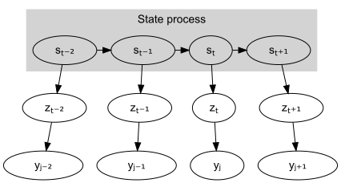

# Summary

# Statement of need

[@Baldwin2018] [@AugerMethe2021] [@Jonsen2005]

# Mathematics

Hidden Markov Models (HMM) describe the evolution of a sequence of random variables, $\{S_t\}$ (i.e. behavioural states), which are not directly observable, but can be inferred from another sequence of random variables, $\{Y_t\}$, that are observable (i.e. locations). In the use case of `movetrack`, the hidden state sequence may alter between 'directed flight' or 'local movement', but the number of states affecting flight directionality can easily be set appropriately using the `states` argument. It is also possible to run a simple correlated random walk with only one state (`states = 1`).

The two main characteristics of HMMs are (1) each observation is assumed to be generated by one of $N$ distributions, and (2) the hidden state sequence that determines which of the $N$ distributions is chosen at time $t$ is modelled as a Markov chain, where the probability of being in each state at time $t$ depends only on the state value at the previous time step.

### State process

The state process $\{S_t\}$ of a $N$-state HMM for $T$ time steps is characterised by its state transition probability matrix $\Gamma^{(t)} = (\gamma^{(t)}_{i,j})$, where $i,j = 1, \dots, N$ and $\gamma^{(t)}_{i,j} = \text{Pr}(s_{t+1} = j|s_t = i)$. The probability of transitioning to state $s_t$ from state $s_{t-1}$ is

$$
s_t \sim \text{Categorical}(\Gamma^{(t-1)}),
    \quad 1 \leq t \leq T.
$$

### Process model

The process equation for the true locations of the animal at regular time intervals $t$, $z_t = \begin{bmatrix} z_{t, \text{lon}} \\ z_{t, \text{lat}} \end{bmatrix}$, assumes that the animal's location at time $t$ is not only dependent on the previous location, $z_{t-1}$, but also on the animal's previous displacement in each coordinate, $z_{t-1} - z_{t-2}$:

$$
z_t = z_{t-1} + \lambda_n (z_{t-1} - z_{t-2}) + \epsilon_t, 
    \quad \epsilon_t \sim \text{N}(0, \Omega),
    \quad 1 \leq n \leq N,
$$

where

$$
\Omega = 
    \begin{bmatrix} 
        \tau^2_{\epsilon, \text{lon}} & 0 \\ 
        0 & \tau^2_{\epsilon, \text{lat}} 
    \end{bmatrix}.
$$

The state-depended parameter, $\lambda_n$, can take values between 0 and 1 (i.e., $0 \leq \lambda \leq 1$), and controls the degree of correlation between steps. By default, `movetrack` estimates track-specific $\lambda_n$ values, but it is also possible to use the same $\lambda_n$ for all tracks by setting `i_lambda = FALSE`.

### Observation model

The observed locations of an animal, $y_j = \begin{bmatrix} y_{j, \text{lon}} \\ y_{j, \text{lat}} \end{bmatrix}$, often have irregular time intervals $j$, with $J$ representing the total number of observed locations. Therefore, the true location of the animal is linearly interpolated to the time of the observation, with $w_j$ representing the proportion of the regular time interval between $t-1$ and $t$ when the observation $y_j$ was made:

$$
y_j = w_j z_t + (1 - w_j) z_{t-1} + \theta_j, 
    \quad \theta_j \sim \text{T}(0, \sigma), 
    \quad 1 \leq j \leq J,
$$

where $\text{T}(0, \sigma)$ denotes a bivariate Student's $t$-distribution with measurement error $\sigma = \begin{bmatrix} \sigma_{\text{lon}} \\ \sigma_{\text{lat}} \end{bmatrix}$.

# Acknowledgements

# References